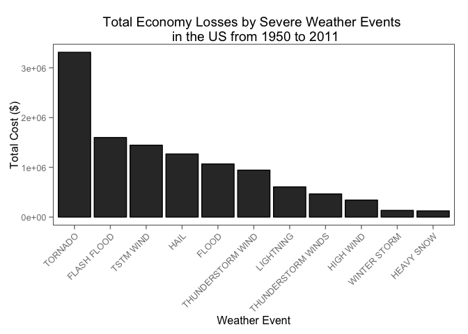
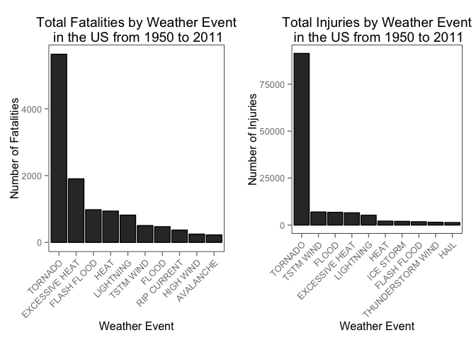

# The Impact of Severe Weather Events on the Public Health and Economy in the US from 1950 to 2011
Weijia Chen  
8 September 2014  

### Synonpsis

The aim of this report is to investigate the impact of different severe weather events on public health and economy based on the storm database collected by the US National Oceanic and Atmospheric Administration's (NOAA) from 1950 to 2011. The variables which are applied in this report include **_fatalities_**, **_injuries_**, **_property_** and **_crop damage_** to identify the most harmful weather event to the population health and economy. Based on the explortary data analysis, it is found that Tornado is the most dominated severe weather event to contribute the damage of both public health and economy.

### Data Precessing


```r
library(R.utils)
fileURL <- "http://d396qusza40orc.cloudfront.net/repdata%2Fdata%2FStormData.csv.bz2"
download.file(fileURL, destfile = "~/Downloads/stormdata.csv.bz2") #download the zip file
bunzip2("~/Downloads/stormdata.csv.bz2", overwrite=T, remove=F) #unzip the file
stormdata <- read.csv("~/Downloads/stormdata.csv", sep = ",") #load file and store it to stormdata object
```

Load relevant graphic system and time package

```r
library(gridExtra)
```

```
## Loading required package: grid
```

```r
library(ggplot2)
library(lubridate)
library(dplyr)
```

```
## 
## Attaching package: 'dplyr'
## 
## The following objects are masked from 'package:lubridate':
## 
##     intersect, setdiff, union
## 
## The following objects are masked from 'package:stats':
## 
##     filter, lag
## 
## The following objects are masked from 'package:base':
## 
##     intersect, setdiff, setequal, union
```

Getting and cleaning data: first change data object class and BGN_DATE to time class, remove blank variables, change variable names to lower case, remove underline.


```r
names(stormdata) <- tolower(names(stormdata)) #change variable names to lower case
names(stormdata) <- gsub("_","",names(stormdata)) #remove underline
stormdata <- tbl_df(stormdata) #902297 * 37
stormdata <- select(stormdata, -(bgnrange: endlocati), -(cropdmgexp:zonenames), -remarks) #remove unused variable
stormdata$bgndate <- mdy_hms(stormdata$bgndate) #change bgndate class to date
stormdata <- mutate(stormdata, ecolos = propdmg + cropdmg) #add one new col named ecolos. It means economic losses. It equals to propdmg + cropdmg 58734 * 21
select(stormdata, evtype, fatalities, injuries, ecolos) #check the required four variables
```

```
## Source: local data frame [902,297 x 4]
## 
##     evtype fatalities injuries ecolos
## 1  TORNADO          0       15   25.0
## 2  TORNADO          0        0    2.5
## 3  TORNADO          0        2   25.0
## 4  TORNADO          0        2    2.5
## 5  TORNADO          0        2    2.5
## 6  TORNADO          0        6    2.5
## 7  TORNADO          0        1    2.5
## 8  TORNADO          0        0    2.5
## 9  TORNADO          1       14   25.0
## 10 TORNADO          0        0   25.0
## ..     ...        ...      ...    ...
```

#### Impact on Economy

Investigate the most harmful evtype have the greatest economic consequences. Variables evtype and ecolos. Preparing the data frame for bar and pie chart of the impact of sever weather event on economy.


```r
stormdata <- group_by(stormdata, evtype) #group the stormdata by evtype
ecolosdata <- summarise(stormdata, ecolos = sum(ecolos)) #assign a new object to sort evtype and ecolos data
ecolosdata <- arrange(ecolosdata, desc(ecolos)) #descending the data by ecolos
ecolosdata <- mutate(ecolosdata, percentage = round(ecolosdata$ecolos / sum(ecolosdata$ecolos) * 100, digits = 0))
ecolostop <- filter(ecolosdata, ecolos >= 100000)
ecolostop$evtype <- factor(ecolostop$evtype, levels = ecolostop$evtype)
ecolostop5 <- ecolostop[1:6,]
ecolostop5$evtype <- as.character(ecolostop5$evtype)
ecolostop5$evtype[6] <- c("other")
ecolostop5$ecolos[6] <- sum(ecolosdata$ecolos) - 8693036
ecolostop5$percentage[6] <- 29
head(ecolosdata, n = 12) #check the top ten events which cause the significant economic losses
```

```
## Source: local data frame [12 x 3]
## 
##                evtype  ecolos percentage
## 1             TORNADO 3312277         27
## 2         FLASH FLOOD 1599325         13
## 3           TSTM WIND 1445168         12
## 4                HAIL 1268290         10
## 5               FLOOD 1067976          9
## 6   THUNDERSTORM WIND  943636          8
## 7           LIGHTNING  606932          5
## 8  THUNDERSTORM WINDS  464978          4
## 9           HIGH WIND  342015          3
## 10       WINTER STORM  134700          1
## 11         HEAVY SNOW  124418          1
## 12           WILDFIRE   88824          1
```

#### Impact on Public Health

Investigate the most harmful evtype with respect to population health. Variables evtype, fatalities, and injuries will be used.

#### Fatalities by severe weather


```r
stormdata <- group_by(stormdata, evtype) #group the stormdata by evtype
fatadata <- summarise(stormdata, fatalities = sum(fatalities)) #assign a new object to sort evtype and fatalities data
fatadata <- arrange(fatadata, desc(fatalities)) #descending the data by fatalities
fatatop <- filter(fatadata, fatalities >= 220)
fatatop$evtype <- factor(fatatop$evtype, levels = fatatop$evtype)
head(fatadata, n = 20) 
```

```
## Source: local data frame [20 x 2]
## 
##                     evtype fatalities
## 1                  TORNADO       5633
## 2           EXCESSIVE HEAT       1903
## 3              FLASH FLOOD        978
## 4                     HEAT        937
## 5                LIGHTNING        816
## 6                TSTM WIND        504
## 7                    FLOOD        470
## 8              RIP CURRENT        368
## 9                HIGH WIND        248
## 10               AVALANCHE        224
## 11            WINTER STORM        206
## 12            RIP CURRENTS        204
## 13               HEAT WAVE        172
## 14            EXTREME COLD        160
## 15       THUNDERSTORM WIND        133
## 16              HEAVY SNOW        127
## 17 EXTREME COLD/WIND CHILL        125
## 18             STRONG WIND        103
## 19                BLIZZARD        101
## 20               HIGH SURF        101
```

#### Injuries by severe weather


```r
stormdata <- group_by(stormdata, evtype) #group the stormdata by evtype
injurydata <- summarise(stormdata, injuries = sum(injuries)) #assign a new object to sort evtype and injuries data
injurydata <- arrange(injurydata, desc(injuries)) #descending the data by injuries
injurytop <- filter(injurydata, injuries >= 1330)
injurytop$evtype <- factor(injurytop$evtype, levels = injurytop$evtype)
head(injurydata, n = 20) 
```

```
## Source: local data frame [20 x 2]
## 
##                evtype injuries
## 1             TORNADO    91346
## 2           TSTM WIND     6957
## 3               FLOOD     6789
## 4      EXCESSIVE HEAT     6525
## 5           LIGHTNING     5230
## 6                HEAT     2100
## 7           ICE STORM     1975
## 8         FLASH FLOOD     1777
## 9   THUNDERSTORM WIND     1488
## 10               HAIL     1361
## 11       WINTER STORM     1321
## 12  HURRICANE/TYPHOON     1275
## 13          HIGH WIND     1137
## 14         HEAVY SNOW     1021
## 15           WILDFIRE      911
## 16 THUNDERSTORM WINDS      908
## 17           BLIZZARD      805
## 18                FOG      734
## 19   WILD/FOREST FIRE      545
## 20         DUST STORM      440
```


### Results

Because evtype is a categorical variable, ecolos, fatalities and injuries are numeric variables, therefore, bar chart and pie chart are appropriate in visualising the results. 

#### Bar plot of impact on Economy

```r
ecolosplot <- ggplot(data = ecolostop, aes(x = evtype, y = ecolos)) + 
        geom_bar(stat="identity", colour="black") + xlab("Weather Event") + 
        ylab("Total Cost ($)") +  
        ggtitle("Total Economy Losses by Severe Weather Events \n in the US from 1950 to 2011") + 
        theme(panel.background = element_rect(fill = 'white', colour = 'black'), panel.grid.major = element_blank(), 
    panel.grid.minor = element_blank(), axis.text.x = element_text(angle = 45,hjust = 1)) 
        
ecolosplot
```

 

#### Pie chart of fatalities by severe weather


```r
slices <- ecolostop5$percentage
lbls <- ecolostop5$evtype
pct <- round(slices/sum(slices)*100)
lbls <- paste(lbls, pct) # add percents to labels 
lbls <- paste(lbls,"%",sep="") # ad % to labels 
pie(slices,labels = lbls, col=rainbow(length(lbls)),
          main="Pie Chart of Severe Weather Event in Impacting the Economy Losses \n in the US from 1950 to 2011")
```

 


#### Bar plot of fatalities by severe weather


```r
fataplot <- ggplot(data = fatatop, aes(y = fatalities, x = evtype)) + 
        geom_bar(stat = "identity", colour = "black") + xlab("Weather Event") +
        ylab("Number of Fatalities") + ggtitle("Total Fatalities by Weather Event\n in the US from 1950 to 2011") + theme(panel.background = element_rect(fill = 'white', colour = 'black'), panel.grid.major = element_blank(), 
    panel.grid.minor = element_blank(), axis.text.x = element_text(angle = 45,hjust = 1))
```

#### Bar plot of fatalities by severe weather


```r
injuryplot <- ggplot(data = injurytop, aes(y = injuries,x = evtype)) + 
        geom_bar(stat = "identity", colour = "black") + xlab("Weather Event") +
        ylab("Number of Injuries") + ggtitle("Total Injuries by Weather Event\n in the US from 1950 to 2011") + theme(panel.background = element_rect(fill = 'white', colour = 'black'), panel.grid.major = element_blank(), 
    panel.grid.minor = element_blank(), axis.text.x = element_text(angle = 45,hjust = 1))
```

#### Plot output

```r
grid.arrange(fataplot, injuryplot, ncol = 2)
```

 


## Conclusion

From the top ten ecolostop data, it can be clearly seen that *Tornados* cause the greatest economic impact from 1950 to 2011. From the pie char, it can be clearly seen that the top five sever weather events, *TORNADO*, *FLASH FLOOD*, *TSTM WIND*, *HAIL* and *FLOOD* accounting for 71 per cent economic losses from 1950 to 2011. Meanwhile, **Tornados** cause the greatest fatalities and injuries impact from 1950 to 2011 as well


